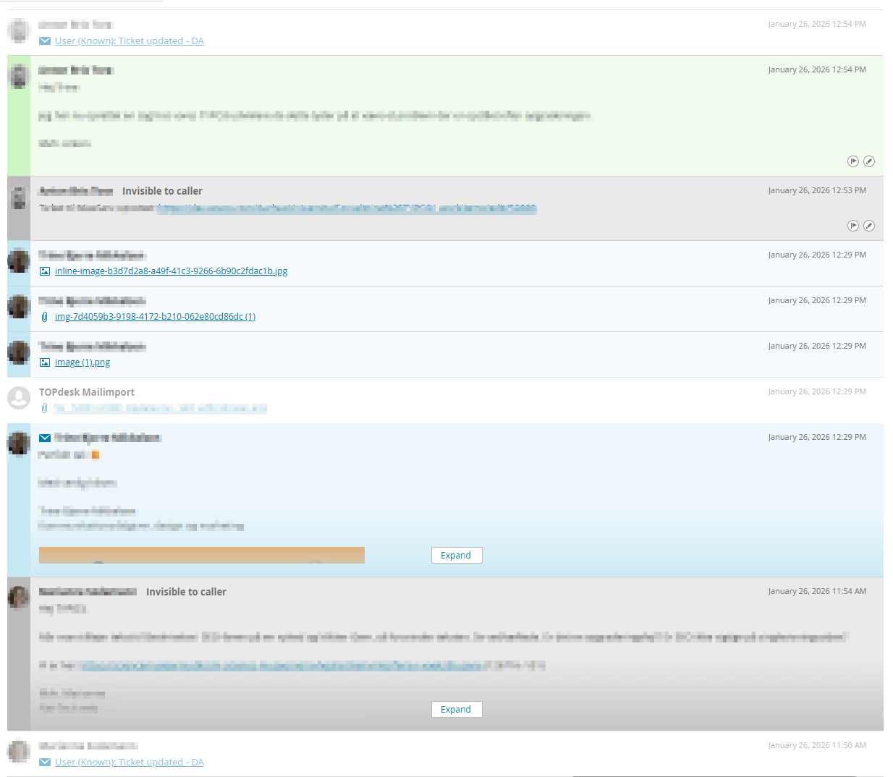
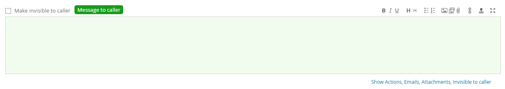
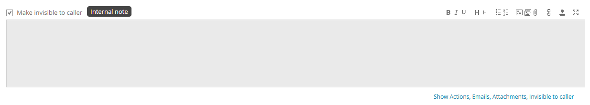
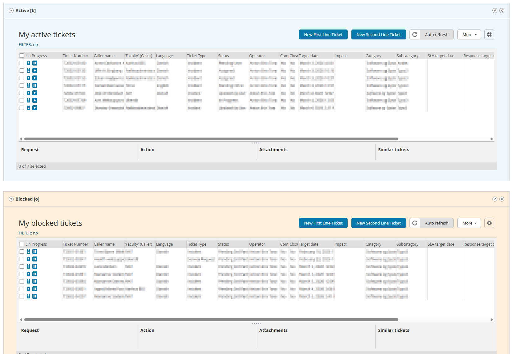

# AU TOPdesk Styling

Shared UI improvements for TOPdesk at Aarhus University.

## Installation

1. Install Stylus extension:
   - [Chrome](https://chrome.google.com/webstore/detail/stylus/clngdbkpkpeebahjckkjfobafhncgmne)
   - [Firefox](https://addons.mozilla.org/en-US/firefox/addon/styl-us/)
2. Click: [Install AU TOPdesk Styling](https://aarhusuniversitet.github.io/au-topdesk-styling/dist/au-topdesk.user.css)
3. Click **Install** in Stylus

The style applies only to `au.topdesk.net` and updates automatically.

## Features

### Colorful Ticket Entry Trail

Ticket entries are color-coded for better visibility:

- **Green background** - Entries from operators that are visible to the caller
- **Gray background** - Internal notes (invisible to caller)
- **Blue background** - Messages from the caller



### Enhanced "Make Invisible to Caller" Indicator

The ticket entry field shows a clear visual indicator when the "Make invisible to caller" checkbox is toggled:

- **Green background + "Message to caller"** label when checkbox is OFF (visible to caller)
- **Gray background + "Internal note"** label when checkbox is ON (invisible to caller)




### Widget Color Coding

You can color-code widgets by adding a color code to the end of the widget title:

- `[r]` - Red background
- `[b]` - Blue background
- `[g]` - Green background
- `[o]` - Orange background
- `[y]` - Yellow background
- `[p]` - Purple background
- `[gr]` - Gray background

**Example:** A widget titled "Server Status [r]" will have a red background.



## Development

### Build

```bash
npm install
npm run build
```

The build script:
- Reads all CSS files from `src/modules/`
- Bundles and minifies them
- Outputs to `dist/au-topdesk.user.css`

### Add New Styles

1. Create a new `.css` file in `src/modules/`
2. Run `npm run build`
3. Commit both the module and built file

## License

MIT
